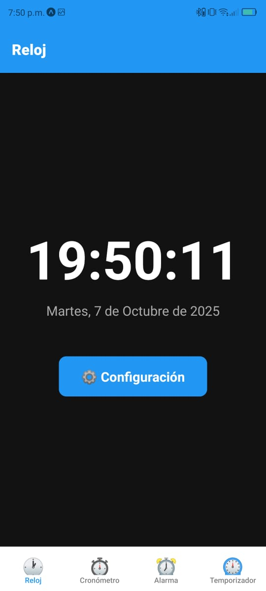
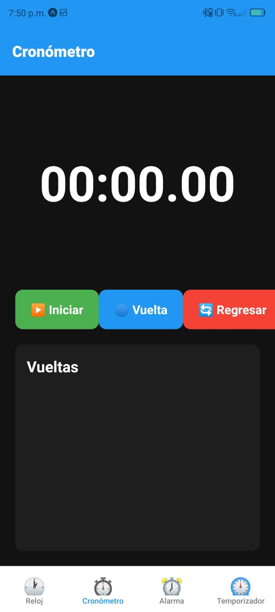
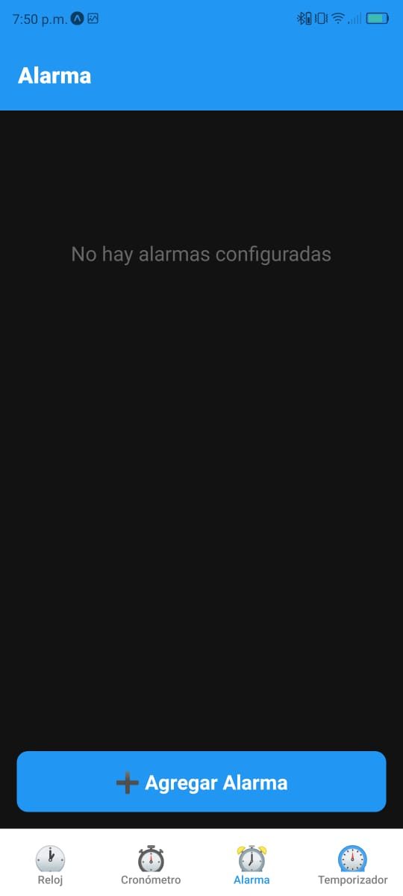
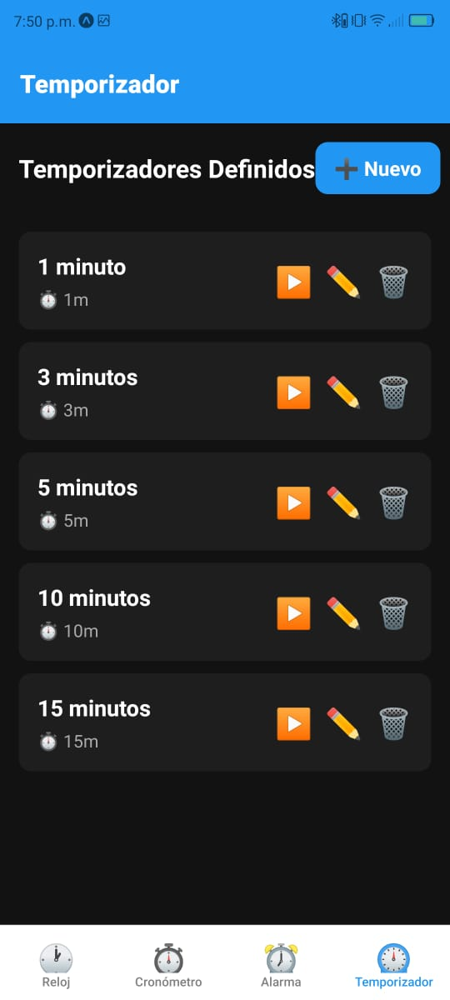

# Clock App - Aplicación de Reloj Multifuncional

## 1. Identificación del Proyecto

- **Nombre de la App:** Clock App
- **Asignatura/Profesor:** Desarrollo de Aplicaciones Móviles / [Tu Nombre del Profesor]
- **Periodo/Fecha:** Octubre 2025
- **Desarrollador:** Juan Alejandro Molina Damian 
- **URL del Repositorio:** [Tu URL de GitHub]

## 2. Descripción del Proyecto

Clock App es una aplicación móvil desarrollada con React Native y Expo que proporciona funcionalidades completas de reloj, cronómetro, alarma y temporizador. La aplicación cuenta con una interfaz moderna con tema oscuro y navegación fluida mediante tabs en la parte inferior.

### Características Principales:
- 🕐 **Reloj Digital**: Visualización de hora actual con fecha completa en español
- ⏱️ **Cronómetro**: Medición precisa de tiempo con registro de vueltas
- ⏰ **Alarma**: Sistema completo de alarmas con selección de música
- ⏲️ **Temporizador**: Temporizadores predefinidos y personalizables
- 🎨 **Interfaz Moderna**: Diseño con tema oscuro y componentes estilizados
- 🧭 **Navegación Intuitiva**: Sistema de navegación por tabs con iconos
- 📊 **Datos Persistentes**: Manejo de estado en memoria durante la sesión

### Funcionalidades Implementadas:
- Reloj digital con formato 12/24 horas configurable
- Cronómetro con precisión de centésimas de segundo
- Sistema de alarmas con múltiples tonos musicales
- Temporizadores personalizables con barra de progreso
- Configuraciones independientes por funcionalidad
- Diseño responsivo y optimizado para móviles
- Estructura de código modular y escalable

## 3. Tecnologías y Versiones Utilizadas

### Stack Tecnológico:
- **React Native:** 0.76.5
- **React:** 18.3.1
- **Expo:** ~54.0.0
- **React Navigation:** v6.1.9 (Bottom Tabs v6.5.11)
- **React Native Screens:** ~4.4.0
- **React Native Safe Area Context:** 4.14.0
- **Expo Status Bar:** ~2.0.0

### Herramientas de Desarrollo Requeridas:

- **Node.js:** v18.17.0 o superior
  ```bash
  node --version
  ```
- **NPM:** 9.0.0+
  ```bash
  npm --version
  ```
- **Expo CLI:** v6.3.0+
  ```bash
  npx expo --version
  ```
- **Expo Go:** v54.0.5 (en dispositivo físico)
  ```bash
  # Descargar desde Play Store o App Store
  ```

### Verificación de Entorno:
```bash
npx expo doctor
```

## 4. Estructura del Proyecto

### Organización de Archivos:
```
clock-app/
├── App.js                          # Componente principal de la aplicación
├── app.json                        # Configuración de Expo
├── package.json                    # Dependencias y scripts
├── assets/                         # Recursos estáticos
│   ├── adaptive-icon.png
│   ├── favicon.png
│   ├── icon.png
│   └── splash.png
└── src/
    ├── navigation/                 # Configuración de navegación
    │   └── AppNavigator.js        # Navegación principal (Bottom Tabs)
    ├── screens/                    # Pantallas de la aplicación
    │   ├── ClockScreen.js         # Pantalla del reloj principal
    │   ├── StopwatchScreen.js     # Pantalla del cronómetro
    │   ├── AlarmScreen.js         # Pantalla de alarmas
    │   └── TimerScreen.js         # Pantalla de temporizadores
    └── screenshots/                # Capturas de pantalla
        ├── reloj.jpg
        ├── cronometro.jpg
        ├── alarma.jpg
        └── temporizador.jpg
```

### Arquitectura de la Aplicación:
- **App.js**: Componente raíz con NavigationContainer
- **AppNavigator.js**: Configuración del Bottom Tab Navigator
- **ClockScreen.js**: Pantalla principal con reloj digital y configuración
- **StopwatchScreen.js**: Cronómetro con vueltas y controles
- **AlarmScreen.js**: Gestión completa de alarmas
- **TimerScreen.js**: Temporizadores predefinidos y personalizados

## 5. Instalación y Configuración

### Instalación de Dependencias:
```bash
# Clonar el repositorio
git clone [tu-url-de-repositorio]
cd clock-app

# Instalar dependencias
npm install
```

### Dependencias del Proyecto:

| Dependencia | Versión | Propósito |
|-------------|---------|-----------|
| `@react-navigation/native` | ^6.1.9 | Core de navegación entre pantallas, manejo de estado de navegación |
| `@react-navigation/bottom-tabs` | ^6.5.11 | Bottom tab navigator para navegación principal entre funciones |
| `react-native-screens` | ~4.4.0 | Optimización de rendimiento para transiciones nativas |
| `react-native-safe-area-context` | 4.14.0 | Manejo de áreas seguras (notch, barras de estado) |
| `expo-status-bar` | ~2.0.0 | Control de apariencia de barra de estado |
| `expo` | ~54.0.0 | Framework de desarrollo móvil |
| `react` | 18.3.1 | Biblioteca de interfaz de usuario |
| `react-native` | 0.76.5 | Framework de desarrollo móvil multiplataforma |

### Verificar instalación:
```bash
npm list --depth=0
```

## 6. Ejecución de la Aplicación

### Scripts Disponibles:
```bash
# Iniciar servidor de desarrollo
npm start
# o
npx expo start

# Ejecutar en Android (emulador/dispositivo)
npm run android
# o
npx expo start --android

# Ejecutar en iOS (solo macOS)
npm run ios
# o  
npx expo start --ios

# Ejecutar en web
npm run web
# o
npx expo start --web
```

### Primera Ejecución:
1. **Instalar dependencias:**
   ```bash
   npm install
   ```

2. **Iniciar el servidor de desarrollo:**
   ```bash
   npm start
   ```

3. **Conectar dispositivo:**
   - **Android:** Usar Expo Go v54.0.5 o emulador
   - **iOS:** Usar Expo Go v54.0.5 o simulador
   - **Recomendado:** Usar Expo Go en dispositivo físico

### Notas de Entorno:
- **Emulador Android:** Debe estar iniciado antes de ejecutar `npm run android`
- **Dispositivo físico:** Usar Expo Go v54.0.5 y escanear QR code
- **Túnel para redes restrictivas:** `npx expo start --tunnel`
- **Limpiar caché:** `npx expo start -c` si hay problemas

## 7. Funcionalidades de la Aplicación

### Pantalla de Reloj (ClockScreen):
- **Reloj Digital**: Muestra la hora actual en tiempo real
- **Fecha Completa**: Día de la semana, día, mes y año en español
- **Botón de Configuración**: Acceso a opciones de visualización
- **Configuraciones Disponibles**:
  - Formato 24 horas / 12 horas (AM/PM)
  - Mostrar/ocultar segundos
- **Diseño**: Interfaz con tema oscuro y tipografía grande y legible



### Pantalla de Cronómetro (StopwatchScreen):
- **Cronómetro de Precisión**: Medición con centésimas de segundo
- **Botones de Control**:
  - ▶️ **Iniciar**: Comienza la medición de tiempo
  - ⏸️ **Pausar**: Detiene temporalmente el cronómetro
  - 🔵 **Vuelta**: Registra tiempo parcial (solo cuando está corriendo)
  - 🔄 **Regresar**: Reinicia el cronómetro a 00:00.00
- **Registro de Vueltas**: Lista de tiempos parciales en orden inverso
- **Formato de Tiempo**: MM:SS.CS (minutos:segundos.centésimas)



### Pantalla de Alarma (AlarmScreen):
- **Lista de Alarmas**: Visualización de todas las alarmas configuradas
- **Crear Nueva Alarma**: Botón "➕ Agregar Alarma"
- **Configuración de Alarma**:
  - Selección de hora mediante controles ▲▼
  - Etiqueta personalizable
  - Selector de música (5 tonos disponibles)
- **Gestión de Alarmas**:
  - Switch para activar/desactivar
  - ✏️ **Modificar**: Editar alarma existente
  - 🗑️ **Eliminar**: Borrar alarma
- **Tonos de Música**:
  - Tono 1 - Clásico
  - Tono 2 - Suave
  - Tono 3 - Energético
  - Tono 4 - Natural
  - Tono 5 - Digital



### Pantalla de Temporizador (TimerScreen):
- **Temporizadores Predefinidos**: 1, 3, 5, 10 y 15 minutos
- **Crear Temporizador Personalizado**: Botón "➕ Nuevo"
- **Configuración de Temporizador**:
  - Nombre personalizable (opcional)
  - Entrada de minutos y segundos
- **Gestión de Temporizadores**:
  - ▶️ **Iniciar**: Ejecutar temporizador
  - ✏️ **Editar**: Modificar tiempo y nombre
  - 🗑️ **Eliminar**: Borrar temporizador
- **Vista Activa**:
  - Visualización grande del tiempo restante
  - Barra de progreso visual
  - ⏸️ **Pausar**: Detener temporalmente
  - 🔄 **Regresar**: Volver a lista de temporizadores
- **Notificación**: Alerta cuando el tiempo termina



### Características Técnicas:
- **Navegación Bottom Tabs**: Acceso rápido a las 4 funciones principales
- **Diseño Responsivo**: Optimizado para diferentes tamaños de pantalla
- **Tema Oscuro**: Interfaz moderna con colores oscuros (#121212, #1e1e1e)
- **Componentes Modulares**: Código organizado y reutilizable
- **Gestión de Estado**: useState y useEffect para manejo de datos
- **Modales**: Interfaces emergentes para configuración y creación

## 8. Desarrollo y Extensión

### Próximas Funcionalidades Sugeridas:
- **Persistencia de Datos**: Integrar AsyncStorage para guardar alarmas y temporizadores
- **Notificaciones Push**: Alarmas que funcionen en segundo plano
- **Sonidos Reales**: Integrar archivos de audio para las alarmas
- **Tema Claro/Oscuro**: Cambio dinámico de tema
- **Zona Horaria**: Soporte para múltiples zonas horarias
- **Widgets**: Acceso rápido desde la pantalla de inicio

### Estructura para Nuevas Pantallas:
```javascript
// Ejemplo de nueva pantalla
import React, { useState } from 'react';
import { View, Text, StyleSheet } from 'react-native';

export default function NewScreen() {
  return (
    <View style={styles.container}>
      {/* Contenido de la pantalla */}
    </View>
  );
}

const styles = StyleSheet.create({
  container: {
    flex: 1,
    backgroundColor: '#121212',
  },
});
```

### Agregar Nuevas Funcionalidades:
1. Crear nuevo archivo en `src/screens/`
2. Importar en `src/navigation/AppNavigator.js`
3. Agregar Tab.Screen con icono correspondiente
4. Implementar lógica y estilos

### Personalizar Colores:
```javascript
// Paleta de colores principal
const COLORS = {
  background: '#121212',
  card: '#1e1e1e',
  primary: '#2196F3',
  success: '#4CAF50',
  warning: '#FF9800',
  danger: '#f44336',
  text: '#ffffff',
  textSecondary: '#aaaaaa',
};
```

## 9. Troubleshooting

### Problemas Comunes:
| Problema | Solución |
|----------|----------|
| **Error de instalación** | `npm install --legacy-peer-deps` |
| **Metro cache corrupto** | `npx expo start --clear` |
| **Puerto ocupado** | `npx expo start --port 8082` |
| **Dependencias desactualizadas** | `npx expo doctor` |
| **No se ve en Expo Go** | Verificar versión 54.0.5 de Expo Go |
| **Errores de navegación** | `npm install` y reiniciar servidor |

### Comandos Útiles:
```bash
# Verificar entorno
npx expo doctor

# Limpiar cache
npx expo start --clear

# Reinstalar dependencias
rm -rf node_modules package-lock.json && npm install

# Ver logs detallados
npx expo start --dev-client

# Crear build de producción
npx expo build:android
npx expo build:ios
```

### Errores Conocidos:
- **Cronómetro no inicia**: Verificar que no haya intervalos duplicados
- **Alarmas no suenan**: Funcionalidad preparada, requiere integración de audio
- **Temporizador no notifica**: Alert de JavaScript, requiere notificaciones nativas

## 10. Recursos y Documentación

### Enlaces Oficiales:
- [Documentación de Expo](https://docs.expo.dev/)
- [React Navigation](https://reactnavigation.org/)
- [React Native Docs](https://reactnative.dev/)
- [Expo Components](https://docs.expo.dev/versions/latest/)
- [JavaScript Date Object](https://developer.mozilla.org/es/docs/Web/JavaScript/Reference/Global_Objects/Date)

### Tutoriales Recomendados:
- [React Native - The Practical Guide](https://www.udemy.com/course/react-native-the-practical-guide/)
- [Expo Documentation](https://docs.expo.dev/tutorial/introduction/)
- [React Navigation Tutorial](https://reactnavigation.org/docs/getting-started)

### Comunidad:
- [Expo Forums](https://forums.expo.dev/)
- [React Native Community](https://reactnative.dev/community/overview)
- [Stack Overflow - React Native](https://stackoverflow.com/questions/tagged/react-native)

---

## 📄 Licencia

Este proyecto fue desarrollado con fines educativos.

---

**Desarrollado por:** Juan Alejandro Molina Damian  
**Última actualización:** 7 de octubre 2025  
**Versión:** 1.0.0  
**Compatible con:** Expo SDK 54, React Native 0.76.5